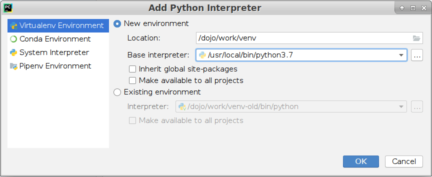

# docker-python-gdojo

A Dojo docker image with Python runtime and [PyCharm](https://www.jetbrains.com/pycharm/).

## Specification

This docker image is based on [python-dojo](https://github.com/kudulab/docker-python-dojo) docker image.
The same python versions are supported by python-gdojo as by python-dojo. This docker image contains all what's in python-dojo and:
 * Pycharm 2019.1.3 community edition

## Usage
1. Install [Dojo](https://github.com/kudulab/dojo)
2. Provide a Dojofile:
```
# docker tag format: <py3 or py2>-<THIS_IMAGE_VERSION>_<BASE_IMAGE_VERSION>
DOJO_DOCKER_IMAGE="kudulab/python-gdojo:py3-1.0.1_1.0.1"
# or:
DOJO_DOCKER_IMAGE="kudulab/python-gdojo:py2-1.0.1_1.0.1"
```
3. Run, example commands:

```bash
# to run PyCharm (your terminal must be interactive):
dojo

# or this way:
dojo "pycharm & /bin/bash"
```

Afterwards, from inside of the docker container, you can run any python command like in python-dojo, e.g.:
```
python --version
```

By default:
 * current directory in docker container is `/dojo/work`.
 * default command is `pycharm & /bin/bash` and it starts PyCharm in a new graphical window


### Configuration using Virtualenv
The very first time you run PyCharm for your project, you have to **add Python interpreter**.
 If you want to use a Virtualenv environment, it is recommended to set its location
 to a local directory, e.g. `/dojo/work/venv`. Then, you have to choose
 Base Interpreter, e.g.: `/usr/local/bin/python3.7`. Do not set: "Inherit global site-packages",
 unless you really need it. (It would result in needing sudo to install packages
 and also in the `/dojo/work/venv` directory not storing all the packages
 needed by your project). This is illustrated on the image below:
 

Once you customize your PyCharm settings (including the Python interpreter),
 a local directory: `.pycharm` will keep all those
 settings (local to your current directory).

You can use the `requirements.txt` file to list all your project Python dependencies.
 In order to install them, you can:
   * either do it from PyCharm. (As soon as you modify the `requirements.txt` file, PyCharm will ask whether to install a requirement)
   * or do it from commandline: `source venv/bin/activate && pip install -r requirements.txt`

Thanks to that, you can work in different docker containers,
created from `python-gdojo` docker image, and you won't have to set PyCharm
again, and you also won't have to reinstall all your project Python dependencies.

#### IntelliJ settings background
If you want to read more about IntelliJ settings, read [this](https://www.jetbrains.com/help/idea/configuring-project-and-ide-settings.html) and [this](https://intellij-support.jetbrains.com/hc/en-us/articles/206544519-Directories-used-by-the-IDE-to-store-settings-caches-plugins-and-logs).
 Basically, IntelliJ has 2 types of settings:
   * project-level stored in <project-dir>/.idea
   * IDE-level stored in a directory like: ~/.PyCharmCE2016.3. (different name for each PyCharm version)

Here we [set](https://intellij-support.jetbrains.com/hc/en-us/articles/207240985-Changing-IDE-default-directories-used-for-config-plugins-and-caches-storage) IDE-level stored settings to be kept in `.pycharm` directory.

## Development
### Dependencies
* Bash
* Docker daemon
* Bats
* [Dojo](https://github.com/ai-traders/dojo)

### Lifecycle
1. In a feature branch:
    * you make changes and add some docs to changelog (do not insert date or version)
    * you build docker images: `./tasks build_local_py3`, `./tasks build_local_py2`
    * and test them: `./tasks itest_py3`, `./tasks itest_py2`
    * to test it interactively: `./tasks example`
1. You decide that your changes are ready and you:
    * merge into master branch
    * run locally:
      * `./tasks set_version` to bump the patch version fragment by 1 OR
      * e.g. `./tasks set_version 1.2.3` to bump to a particular version
    * push to master onto private git server
1. CI server (GoCD) tests and releases.

### Release
This repo has conditional code release, because we build a docker image from this image:
  * if there are new commits in this git repo
  * if new base docker image (python-dojo) was published

In the latter case there are no new commits in this git repo and release was
 already done before. Then, we only want to build and publish new docker image.

## License

Copyright 2019 Ewa Czechowska, Tomasz Sętkowski

Licensed under the Apache License, Version 2.0 (the "License");
you may not use this file except in compliance with the License.
You may obtain a copy of the License at

   http://www.apache.org/licenses/LICENSE-2.0

Unless required by applicable law or agreed to in writing, software
distributed under the License is distributed on an "AS IS" BASIS,
WITHOUT WARRANTIES OR CONDITIONS OF ANY KIND, either express or implied.
See the License for the specific language governing permissions and
